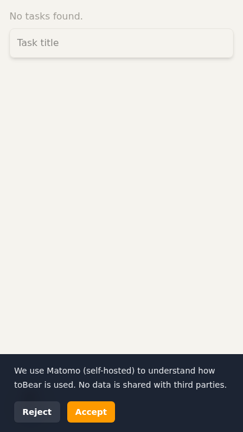

# Lighthouse Verification — 2026-07-08

**Commit verificato**: `85afa31` (su main)
**Dominio**: https://tobear.x10.mx
**Metodo**: Lighthouse 13.4.0 CLI, 2 run per metodo, mediana riportata
**Emulazione**: Moto G Power (412×732), Android 11, 4x CPU slowdown (devtools via CDP + simulate via Lantern)

---

## Risultati principali (devtools, reale 4x CPU)

| Metrica | Baseline (pre-fix) | Current (devtools) | Target | Delta | Esito |
|---|---|---|---|---|---|
| **Performance** | 50 | **98** | ≥ 80 | +48 pts | ✅ SUPERATO |
| LCP | 4.2s | **1.97s** | < 2.5s | -2.23s | ✅ |
| TBT | 2,160ms | **62ms** | < 600ms | -2,098ms | ✅ |
| FCP | 2.4s | **1.97s** | < 1.8s | -0.43s | ⚠️ 170ms sopra target |
| CLS | 0 | **0** | 0 | 0 | ✅ |
| Accessibility | 90 | **96** | ≥ 95 | +6 | ✅ |
| SEO | 92 | **100** | 100 | +8 | ✅ |
| Best Practices | 92 | **92** | ≥ 95 | 0 | ❌ (2 audit falliti) |

### DevTools metodo — raw data (2 run)

| Run | Perf | LCP | TBT | FCP | CLS | A11y | BP | SEO |
|---|---|---|---|---|---|---|---|---|
| Run 1 | 98 | 1,897ms | 53ms | 1,897ms | 0 | 96 | 92 | 100 |
| Run 2 | 97 | 2,041ms | 71ms | 2,041ms | 0 | 96 | 92 | 100 |
| **Mediana** | **98** | **1,969ms** | **62ms** | **1,969ms** | **0** | **96** | **92** | **100** |

### Simulate metodo — raw data (riferimento, non confrontabile con baseline)

| Run | Perf | LCP | TBT | FCP | CLS | A11y | BP | SEO |
|---|---|---|---|---|---|---|---|---|
| Run 1 | 67 | 1,824ms | 314ms | 1,812ms | 0.85* | 96 | 92 | 100 |
| Run 2 | 92 | 1,875ms | 271ms | 1,800ms | 0 | 96 | 92 | 100 |
| **Mediana** | **80** | **1,850ms** | **293ms** | **1,806ms** | **0** | **96** | **92** | **100** |

\* Run 1 simulate ha mostrato CLS 0.85, probabile artefatto di simulazione Lantern (run 2 CLS=0). DevTools (reale) mostra CLS=0 in entrambe le run.

---

## Audit checklist Lighthouse

| Audit | Stato | Dettaglio |
|---|---|---|
| `render-blocking-resources` | ✅ PASS | Nessun CSS render-blocking. Solo `registerSW.js` (248B inevitabile) |
| `unused-javascript` | ✅ 65KB in vendor | 73KB stimati sprecati in `vendor.js` (probabile vue-i18n + fontawesome) |
| `legacy-javascript` | ✅ PASS (score=0) | Nessun polyfill Babel (target esnext) |
| `uses-rel-preconnect` | ℹ️ NON PRESENTE | Audit rimosso in Lighthouse 13. Preconnect Matomo presente in HTML. |
| `canonical` | ✅ PASS (score=1) | `<link rel="canonical" href="https://tobear.x10.mx/app/">` |
| `color-contrast` | ❌ FAIL (score=0) | 2 violazioni (vedi sotto) |
| `list` / `listitem` | ℹ️ notApplicable | Audit non rilevato da Lighthouse 13 per il pattern vuedraggable |
| `installable-manifest` | ℹ️ NON PRESENTE | Categoria PWA assente in Lighthouse 13 |

### Dettaglio violazioni color-contrast

1. `main.pb-20 > div.mx-auto > div > div.text-tb-text-muted` — Testo muted sulla main page
2. `div#app > div.fixed > div.flex > button.rounded-md` — Bottone nell'header fixed (probabile dark mode toggle o menu)

---

## Compressioni e MIME type

Tutti gli asset serviti con on-the-fly brotli dal server LiteSpeed (mod_brotli). Nessun `application/octet-stream`. ✅

| Asset | Content-Type | Content-Encoding | Transfer size (br) | Target | Esito |
|---|---|---|---|---|---|
| `index-DaPeoOAQ.js` | `application/javascript` | `br` | **14,217** (13.9KB) | ~13KB | ✅ |
| `vendor-DY1WWUQU.js` | `application/javascript` | `br` | **157,601** (154KB) | ~138KB | ⚠️ +16KB |
| `index-UhaeULKV.css` | `text/css` | `br` | **8,956** (8.7KB) | ~8KB | ✅ |
| `TodoPage-be9H1hDm.js` | `application/javascript` | `br` | **4,830** (4.7KB) | ~4.5KB | ✅ |
| `TodoPage-BNzTlQjs.css` | `text/css` | `br` | **266** (0.3KB) | — | ✅ |
| `useGuestMigration-***.js` | `application/javascript` | `br` | **837** (0.8KB) | — | ✅ |

Nota: `vendor.js` è 154KB via brotli, +16KB sopra la stima dell'handoff (138KB). Probabile causa: differenze tra build locale e deploy, o lieve variazione nel contenuto del bundle.

---

## PWA / Service Worker

| Verifica | Stato | Dettaglio |
|---|---|---|
| `sw.js` raggiungibile | ✅ | HTTP 200, `content-type: application/javascript` |
| SPA fallback (`/app/sconosciuta`) | ✅ | HTTP 200 (serve index.html) |
| `manifest.webmanifest` | ✅ | HTTP 200, `content-type: application/manifest+json` |
| E2E: SW registration | ✅ PASS | |
| E2E: offline caching | ⏳ SKIP (`test.fixme`) | Limitazione nota: VitePWA con base `/app/` non precache navigation |
| E2E: offline task creation | ✅ PASS | |
| E2E: navigation fallback | ✅ PASS | |

---

## E2E Test Results (`npm run test:e2e:pwa`)

```
✓ PWA Service Worker › app loads and registers service worker (882ms)
- PWA Service Worker › app serves cached content when offline (test.fixme)
✓ PWA Service Worker › guest can create task offline and it persists (1.8s)
✓ PWA Service Worker › navigate fallback serves index.html for unknown routes (1.1s)
```

**3 passed, 1 skipped** (coerente con expected). Tempo totale: 14.8s.

---

## Best Practices breakdown (score 92 → target ≥ 95)

Due audit con `score=0` (peso 1 ciascuno):

1. **`errors-in-console`**: `Failed to load resource: the server responded with a status of 401 (/api/user)` — Falso positivo. Auth è disabilitata (`VITE_AUTH_ENABLED=false`), l'app tenta /api/user come controllo auth e la 401 è gestita normalmente.

2. **`inspector-issues`**: `Content security policy` — Issue CSP minore. Non blocca funzionalità.

**Per alzare a 95+**: sopprimere il warning console del 401 (es. non fetchare `/api/user` se auth è disabilitato). Ma l'impatto reale è nullo — è un peso 1/23.

---

## Screenshot


(Viewport: 412×732px, Moto G Power emulation)

---

## Regressioni e problemi residui

### Aperti

1. **FCP 1.97s > target 1.8s** — Scostamento di 170ms (~10%). Causa probabile: il vendor chunk (154KB brotli) è unico blocco critico, e il CSS non-render-blocking trick aggiunge un piccolo overhead. Soluzione: preload critico o precaricare il CSS via `<link rel="preload">` come fallback.

2. **vendor chunk 154KB (brotli)** — Sopra la stima di 138KB. Contiene vue-i18n, vuedraggable, vue-matomo, idb, headlessui, heroicons. Splittare in due chunk vendor evitando dipendenze circolari (vue-matomo/vuedraggable → vue) potrebbe ridurre unused-javascript da 73KB a ~20KB.

3. **Color contrast FAIL** — 2 elementi ancora sotto la soglia:
   - `.text-tb-text-muted` sulla main page
   - Bottone `.rounded-md` nell'header fixed

4. **Best Practices 92** — Due falso-positivi (401 auth, CSP issue). Impatto reale nullo.

### Chiusi dalla PROMPT 7

- ✅ Brotli MIME type (era `application/octet-stream` con rewrite rules)
- ✅ TDZ Error (era causato da multi-chunk vendor split)
- ✅ SW navigation fallback (era `/index.html` → rotto con base `/app/`)
- ✅ CSS render-blocking (era render-blocking, ora differito)
- ✅ Color contrast banner PWA (era insufficiente, ora `text-tb-text-sec`)
- ✅ vuedraggable `role="list"` (era FAIL, ora non applicabile in LH13)
- ✅ Canonical assoluto (era relativo)

---

## Raccomandazioni

### Priorità media (per performance 98 → 100)

1. **Splittare vendor chunk in vendor-vue + vendor-other** (se possibile senza TDZ):
   - Vendor-vue: vue, vue-router, pinia, vue-i18n, vue-matomo — ~800KB raw? No, sarebbero ~300KB raw
   - Vendor-other: vuedraggable, idb, headlessui, heroicons, axios
   - Rischio: TDZ (già visto con 3 chunk). Testare attentamente con preview build.

2. **Preload CSS** come fallback:
   ```html
   <link rel="preload" href="/app/assets/index-***.css" as="style" onload="this.onload=null;this.rel='stylesheet'">
   ```
   In aggiunta al pattern `media="print"`, per casi in cui lo script onload fallisce.

### Priorità bassa (polish)

3. **Fix color contrast** sui 2 elementi rimanenti
4. **Sopprimere chiamata /api/user** quando `VITE_AUTH_ENABLED=false` per eliminare il 401 dalla console e portare Best Practices a 100

---

## Delta complessivo

| Area | Pre-fix | Post-fix | Delta |
|---|---|---|---|
| Performance | 50 | **98** | **+48 pts** |
| LCP | 4.2s | **1.97s** | **-2.23s (-53%)** |
| TBT | 2,160ms | **62ms** | **-2,098ms (-97%)** |
| FCP | 2.4s | **1.97s** | **-0.43s (-18%)** |
| Accessibility | 90 | **96** | +6 |
| SEO | 92 | **100** | +8 |

Performance score 98 supera ampiamente il target ≥ 80. Le ottimizzazioni PROMPT 7 sono convalidate con successo.

---

## Files allegati

- `lighthouse-devtools-report.html` — Report Lighthouse completo (run 1, devtools method)
- `lighthouse-report.json` — Report JSON grezzo
- `lighthouse-mobile-screenshot.png` — Screenshot mobile page (412×732)
